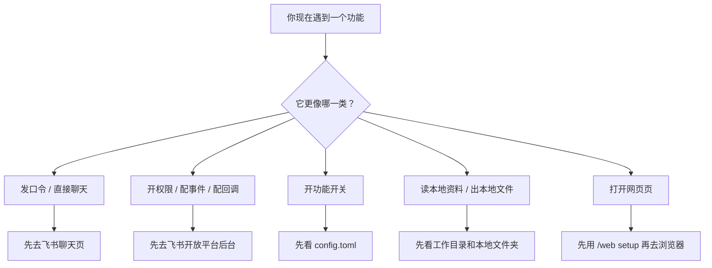

# 飞书 Bridge 新手理解指南


这不是一份“只给会代码的人看”的文档。

这份说明的目标只有一个：让第一次接触飞书 Bridge 的人，也能快速分清楚“我现在该去哪里操作”。

这套 Skill（技能说明）对应的 Bridge（中间桥接层）搭建，基于 [chenhg5/cc-connect](https://github.com/chenhg5/cc-connect)。

这句话的意思是：

- 这个仓库不是从零开始自己造一个 Bridge。
- 它更像是基于 `cc-connect` 整理出来的教程、理解地图和使用指引。
- 如果你只是想先学会怎么配、怎么用，看这份仓库就够了。
- 如果你后面想继续深挖底层实现，再去看 `cc-connect` 原仓库会更合适。

## 先说结论

- 不要把飞书 Bridge 理解成“只有一个后台”。
- 也不要把“4 个位置”当成死规定，那只是方便新手记忆的旧说法。
- 更稳的理解方式是：先把常见操作分成 `5 类`，再判断你现在碰到的是哪一类。

## 先用 5 类理解它

下面这 5 类不是官方唯一分类，而是给普通人最快上手的理解地图。

| 你现在在做什么 | 属于哪一类 | 去哪里操作 |
| --- | --- | --- |
| 跟 bot（机器人）说话、发口令（命令） | 飞书聊天页 | 飞书群聊或私聊 |
| 开权限、收消息、接按钮点击 | 开放平台后台 | 飞书应用后台 |
| 打开某个功能开关 | 本地配置 | `config.toml` |
| 让它读取你的资料、输出文件 | 项目目录 | 你的电脑文件夹 |
| 看网页页面、做 Web 管理 | 网页管理后台 | 浏览器页面 |

## 一张图先看懂



## 这几个词到底是什么意思

很多人不是不会配，而是这些词混在一起了。

| 词 | 意思 | 例子 | 先看哪里 |
| --- | --- | --- | --- |
| 口令（命令） | 你在聊天里发的指令 | `/help`、`/new`、`/web setup` | 飞书聊天页 |
| 权限 | 飞书允不允许应用做事 | 读群成员、发消息 | 开放平台后台 |
| 事件 | 飞书把发生的事通知你 | 收到新消息 | 开放平台后台 |
| 回调 | 飞书把点击结果通知你 | 卡片按钮点击 | 开放平台后台 |
| 配置项 | 你本地开的功能开关 | `resolve_mentions = true` | `config.toml` |
| 工作目录 | agent（智能代理）当前看的文件夹 | `/dir` 切目录 | 聊天页 + 项目目录 |

## 五类里最常见的内容

### 1. 飞书聊天页

这里负责“你怎么和它说话”。

常见口令（命令）：

- `/help`：看可用命令
- `/new`：新建会话
- `/list`：查看会话列表
- `/switch`：切换会话
- `/model`：切换模型
- `/provider`：切换第三方接口
- `/mode`：切换执行模式
- `/reasoning`：切换思考强度
- `/dir`：查看或切换工作目录
- `/show`：查看文件内容
- `/cron`：管理定时任务
- `/web setup`：开启网页管理页
- `/restart`：重启 Bridge

一句话记忆：

- 只要你是“发一句话”或“发一个斜杠命令”，先想飞书聊天页。

### 2. 飞书开放平台后台

这里负责“飞书是否允许它做事”。

最容易混淆的 3 类入口：

| 入口 | 它解决什么问题 |
| --- | --- |
| 权限管理 | 准不准应用做这件事 |
| 事件配置 | 飞书把“发生了什么”发给你 |
| 回调配置 | 飞书把“用户点了什么”发给你 |

一句话区分：

- `权限` = 能不能做
- `事件` = 发生了什么
- `回调` = 用户点了什么

### 3. 本地配置文件

这里负责“功能有没有真正打开”。

常见配置项：

- `resolve_mentions`：自动把 `@名字` 变成真正可点击的艾特
- `attachment_send`：把文件直接发回飞书
- `tts`：语音回复
- `admin_from`：谁可以用高权限命令
- `enable_feishu_card`：卡片能力相关开关

一句话记忆：

- 有些功能不是飞书后台里开，而是你本地自己开。

### 4. 本地项目目录

这里负责“它能读什么资料、能把结果存到哪里”。

常见场景：

- 让 agent 读取教程、清单、素材
- 把输出内容存成 `md`（Markdown 文档）、图片、压缩包
- 切换到某个项目文件夹再继续工作

一句话记忆：

- 只要事情和“本地文件、文件夹、资料”有关，就别只盯着飞书后台。

### 5. 网页管理后台

这里负责“浏览器里的管理页面”。

常见方式：

1. 先在飞书聊天页发 `/web setup`
2. 再根据返回结果打开浏览器页面

一句话记忆：

- 网页管理页通常不是直接猜地址打开，而是先从聊天页拿入口。

## 高频功能速查

| 你想做什么 | 优先看哪里 | 还可能补看哪里 |
| --- | --- | --- |
| 新建会话 | 飞书聊天页 | 无 |
| 切换模型或第三方接口 | 飞书聊天页 | 无 |
| 自动艾特某个人 | 本地配置文件 | 飞书开放平台后台权限 |
| 卡片按钮可点击 | 飞书开放平台后台回调 | 本地配置文件 |
| 把图片或文件发回飞书 | 本地配置文件 | 本地项目目录 |
| 语音回复 | 本地配置文件 | 飞书聊天页 |
| 打开网页管理页 | 飞书聊天页 | 网页管理后台 |
| 限制谁能用 `/restart`、`/dir` | 本地配置文件 | 无 |
| 让它读取你的教程或资料 | 本地项目目录 | 飞书聊天页 |

## 给普通人的最短上手流程

1. 在飞书里把 bot 拉进一个群。
2. 先发 `/help`，确认命令能回应。
3. 再发 `/new`，新建一个会话。
4. 直接发人话试一次，比如“帮我总结这份配置教程要做哪 3 步”。
5. 如果某个功能不工作，不要先乱试，先判断它属于哪一类。

你可以直接复制这段话测试：

```text
请先别急着执行。
先告诉我：我刚才这个需求，主要属于下面哪一类？
1. 飞书聊天页
2. 飞书开放平台后台
3. 本地配置文件
4. 本地项目目录
5. 网页管理后台

然后再告诉我下一步应该去哪里看。
```

## 最容易出错的地方

- `/new` 是新建会话，不是新建飞书群。
- `card.action.trigger` 更像“回调”，不要把它当普通权限去找。
- `resolve_mentions` 是本地配置，不在飞书后台里直接点。
- `/dir`、`/show`、`/restart` 这类命令，常常会受 `admin_from` 控制。
- 想让它读你的资料时，资料本身也要放在它能访问到的文件夹里。

## 这份仓库适合怎么用

如果你是普通使用者：

- 先看这份 `README.md`
- 再看 [QUICKSTART.zh.md](QUICKSTART.zh.md)

如果你是想把这套能力交给 agent：

- 先看这份 `README.md`
- 再看 [SKILL.md](SKILL.md)

## 这份文档的定位

这份文档不是飞书官方文档，也不是完整技术手册。

它更像一个“新手理解地图”：

- 帮你先分清口令（命令）、权限、事件、回调、配置项
- 帮你少走弯路
- 帮你先判断“应该去哪里看”
