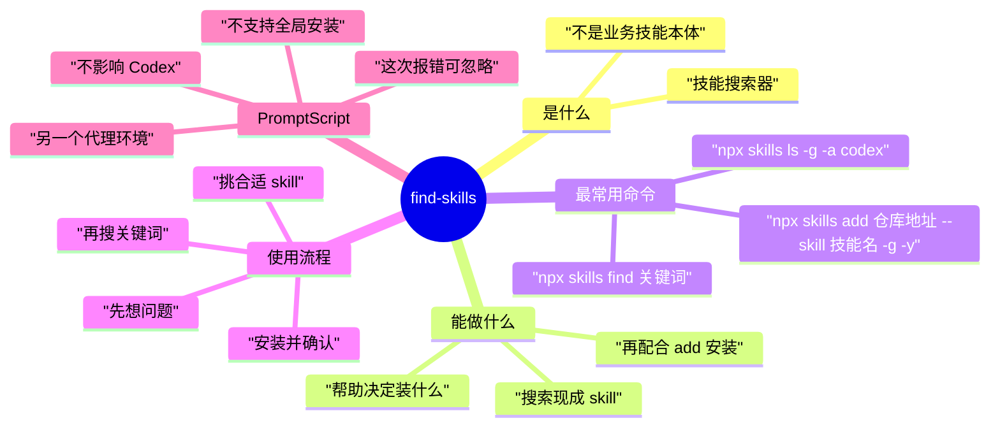

# Find Skills 中文速查

## 一句话结论

`find-skills` 不是业务技能，而是一个“帮你找别的 skill（技能）”的搜索工具。

你可以把它理解成：

- `find-skills` = 技能搜索器
- `npx skills find 关键词` = 搜索有什么现成技能
- 找到后再决定要不要安装

## PromptScript 是什么

按你这次安装日志来理解就够了：

- `PromptScript` 是 `skills` 工具尝试兼容的一个别的代理（agent，另一种助手环境）
- 它不支持“全局安装 skill”
- 所以安装时出现了和它有关的报错
- 这个报错`不影响 Codex 自己的全局安装结果`

简单说：

`PromptScript` 不是你的主线问题，可以先忽略。

## Find Skills 能干什么

它主要用来做 3 件事：

1. 搜索有没有现成 skill
2. 帮你判断大概该装什么 skill
3. 找到后再用安装命令装到 Codex

## 最常用命令

### 1. 搜索 skill

```powershell
npx skills find 关键词
```

例子：

```powershell
npx skills find figma
npx skills find lark
npx skills find writing
npx skills find automation
npx skills find sales
```

### 2. 看 Codex 全局装了哪些 skill

```powershell
npx skills ls -g -a codex
```

### 3. 全局安装某个 skill

```powershell
npx skills add 仓库地址 --skill 技能名 -g -y
```

例子：

```powershell
npx skills add https://github.com/vercel-labs/skills --skill find-skills -g -y
```

## 你该怎么用

最简单流程：

1. 先想你要解决什么问题
2. 用 `npx skills find 关键词` 搜
3. 看到合适的，再安装
4. 安装后用 `npx skills ls -g -a codex` 确认

## 适合你的搜索关键词

你可以先从这些开始：

```powershell
npx skills find xiaohongshu
npx skills find content writing
npx skills find outreach
npx skills find sales
npx skills find negotiation
npx skills find figma
npx skills find feishu
npx skills find automation
```

## 快速判断规则

- 想找“有没有现成技能”：用 `find`
- 想看“我已经装了什么”：用 `ls`
- 想真正装上去：用 `add`

## 思维导图



## 一句话记忆版

```text
find-skills = 先帮我找有什么技能，不是直接替我做业务。
```
